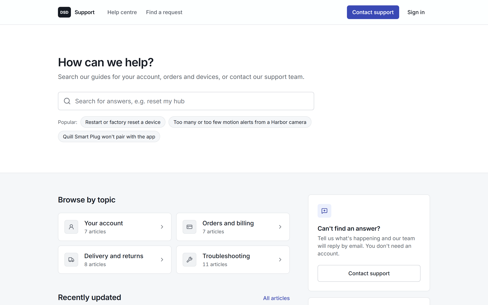
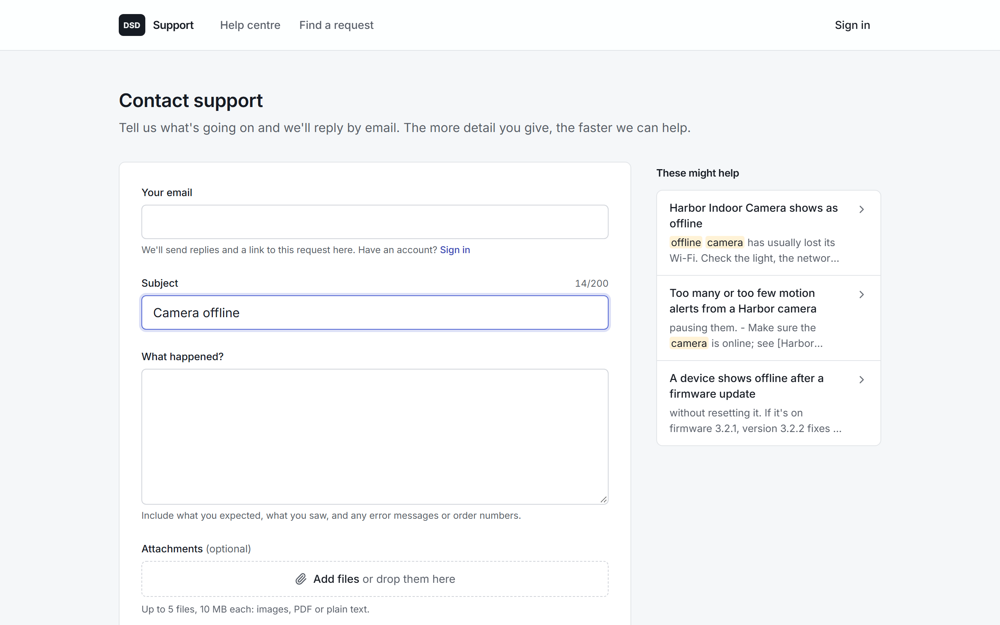
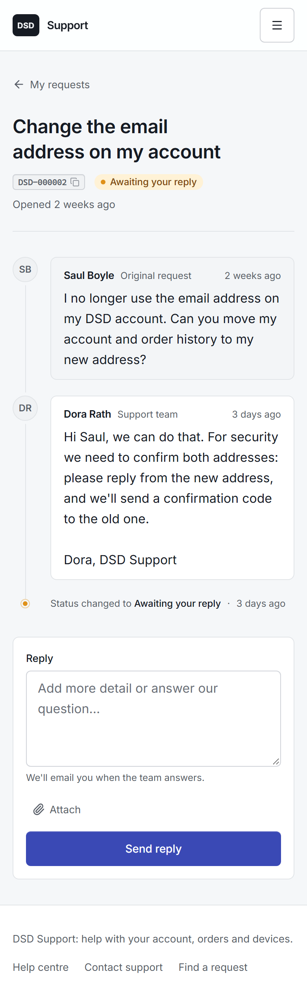
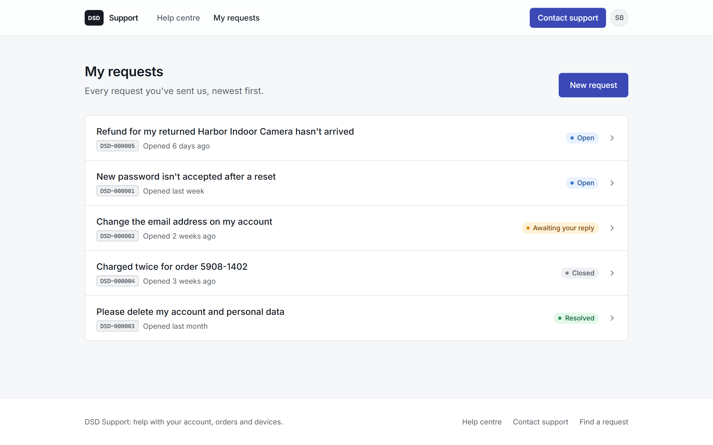
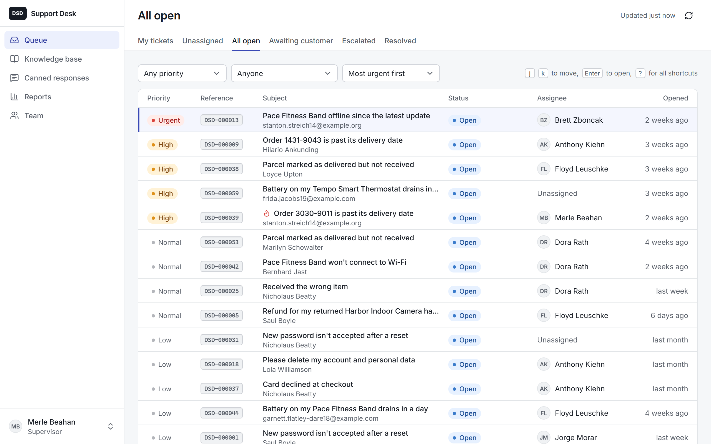
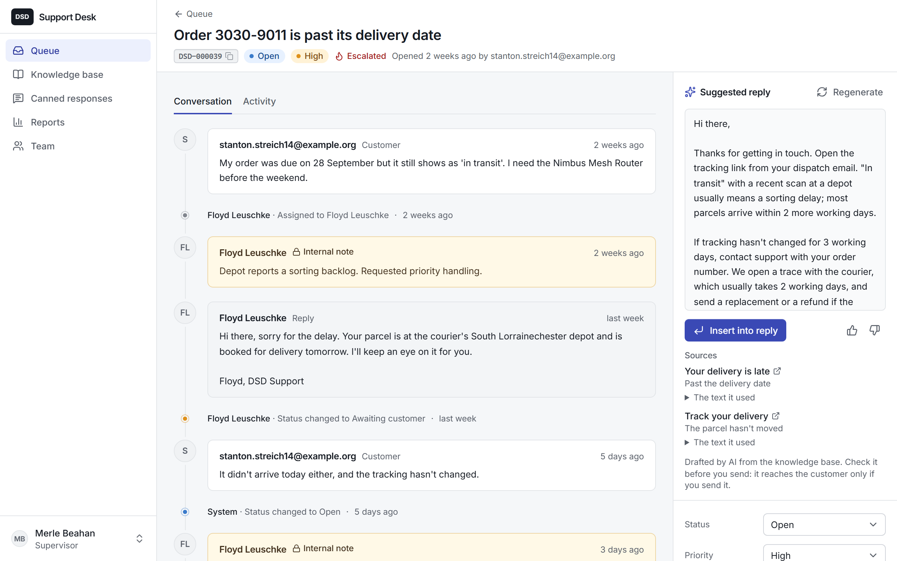
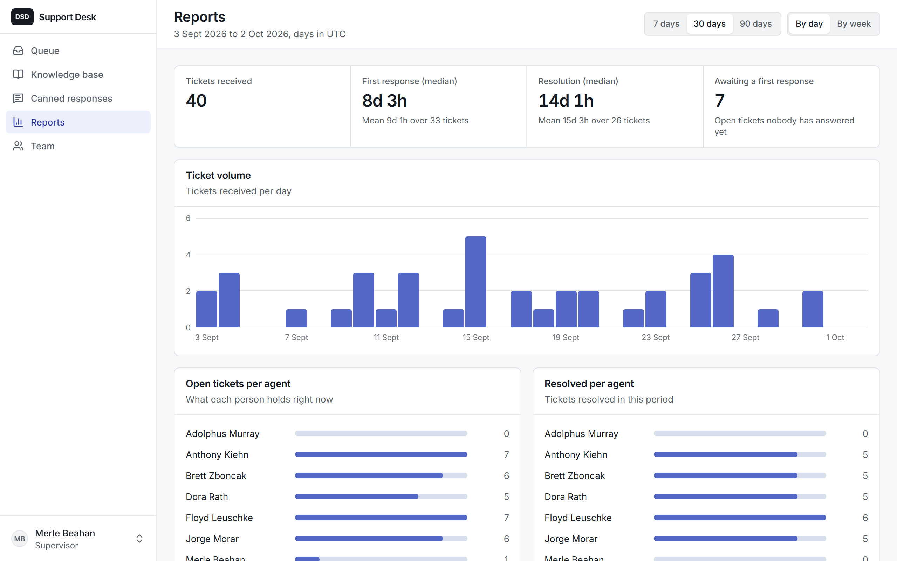
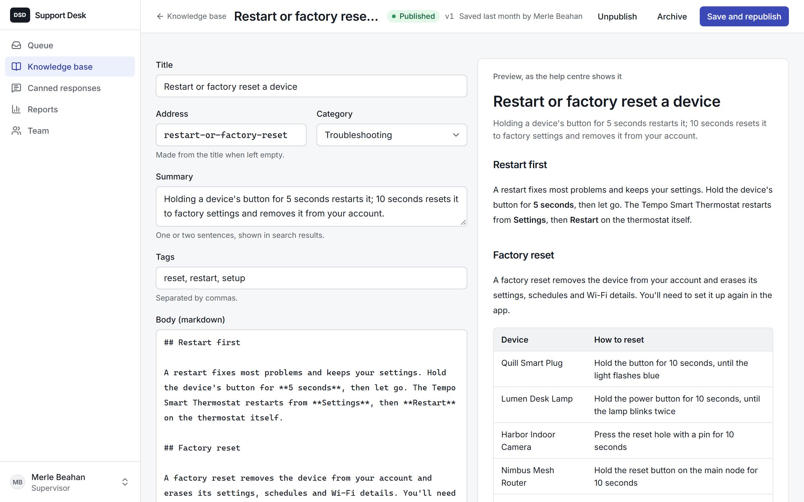
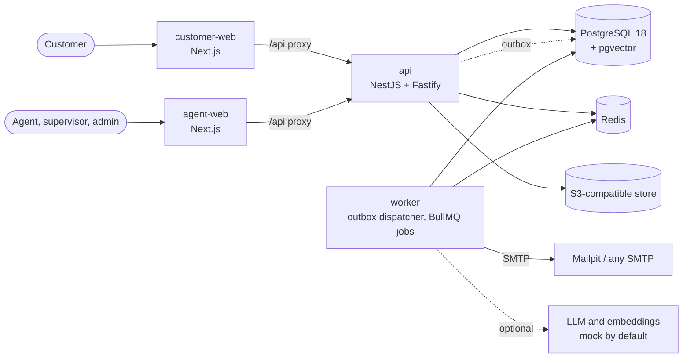

# DSD Unified Customer Support System

A support desk for DSD Group: customers raise tickets and follow them to resolution, and agents, supervisors and admins work those tickets from one shared queue. Replies can start from an AI draft grounded in the knowledge base, and **nothing an AI writes reaches a customer unless an agent sends it**. The rest of this page explains how that and everything else is built, and why.

[docs/TRACEABILITY.md](docs/TRACEABILITY.md) maps every requirement in the [SRS](docs/SRS.md) to the code and the tests that prove it.

## Quick start

You need Git and Docker with Compose v2. No Node.js, no API keys, no `.env` file.

```bash
git clone https://github.com/AqeelDEV/dsd-support-system.git
cd dsd-support-system
docker compose up --build --wait
```

The last command returns once every service is healthy; the first build takes a few minutes.

| What                  | Where                                                     |
| --------------------- | --------------------------------------------------------- |
| Customer app          | http://localhost:3000                                     |
| Agent app             | http://localhost:3001                                     |
| API docs (Swagger UI) | http://localhost:4000/api/docs                            |
| Sent emails (Mailpit) | http://localhost:8025                                     |
| API health            | http://localhost:4000/health, http://localhost:4000/ready |

Stop everything with `docker compose down`, and add `-v` to delete the data too. The defaults are for local use only; to change a password or a port, copy `.env.example` to `.env` and edit it. If a port is taken on Windows, see [Troubleshooting](#troubleshooting).

### Demo accounts

The stack starts with synthetic demo data: 60 tickets in every status, a few with files attached, 35 knowledge-base articles and 6 canned responses. Every demo account's password is `dsd-demo-password`.

| Role       | Email                    | Signs in through        |
| ---------- | ------------------------ | ----------------------- |
| Customer   | `customer@example.com`   | Customer app, port 3000 |
| Agent      | `agent@dsd.example`      | Agent app, port 3001    |
| Supervisor | `supervisor@dsd.example` | Agent app, port 3001    |
| Admin      | `admin@dsd.example`      | Agent app, port 3001    |

Two more staff accounts test the edges: `former.agent@dsd.example` has been deactivated and `new.starter@dsd.example` was invited but never set a password. Neither can sign in.

## A tour

**The customer app** (http://localhost:3000). Without signing in you can search the help centre and contact support: a request needs only an email, a subject and a description, with up to five files. The acknowledgement email carries a link that opens the request, where you can follow the replies and answer; **Find a request** emails a fresh one. Sign in as `customer@example.com` for **My requests**, or create an account: sign-up is email-first, the link to finish it arrives in Mailpit, and earlier requests from that address appear in the account.

**The agent app** (http://localhost:3001).

- **Queue:** saved views, filters and sorting kept in the address, background refresh, and the keyboard (`j`/`k` to move, `Enter` to open, `?` for every shortcut).
- **Ticket:** the conversation with internal notes on an amber surface, the history on a rail, a composer for replies and notes with canned responses (`r`, `n`, `Ctrl+Enter`), the AI-drafted reply beside it, status, priority, assignment, escalation and the customer's other tickets.
- **Knowledge base** with a live preview, **canned responses**, **reports** and **team** management for supervisors and admins.

What each person sees comes from the API: sections from the permissions `/me` reports, and every control on a ticket from its `allowedActions`. An agent who types `/reports` into the address bar is told they don't have access, because the API refuses it.

**Emails.** Every email goes to Mailpit (http://localhost:8025): acknowledgements, replies, status changes, sign-up, password reset and invites. The worker sends them, never a request, so if the mail server is down tickets and replies still go through and the emails follow; a job that keeps failing lands in a dead-letter queue (`docker compose exec worker node dist/cli/dead-letter.js list`, then `replay --all`).

**Swagger UI** (http://localhost:4000/api/docs) documents every route. Sign in with "Try it out" on a `login` route and it adds the CSRF token to later requests.

| Help centre                                                                         | Contact support                                                                    |
| ----------------------------------------------------------------------------------- | ---------------------------------------------------------------------------------- |
|                  |  |
| **A request on a phone**                                                            | **My requests**                                                                    |
|  |     |
| **The agent's queue**                                                               | **A ticket, with an AI-drafted reply, notes and history**                          |
|                                 |                        |
| **Reports**                                                                         | **The knowledge-base editor**                                                      |
|                       |     |

## How an AI draft can never reach a customer without an agent sending it

The AI drafts and an agent sends, and the two never meet. The worker that writes drafts and the API that sends replies are separate processes with separate database roles, and no single layer below is trusted on its own: each has a test that deliberately tries to get past it ([ADR-0006](docs/adr/0006-ai-suggestions-and-guardrail.md), section 8).

| Layer                    | What stops it                                                                                                                                                                                                                                                                                                                                                                             | Proven by                                                                                                                                                                                                                                                                                                                                                                                           |
| ------------------------ | ----------------------------------------------------------------------------------------------------------------------------------------------------------------------------------------------------------------------------------------------------------------------------------------------------------------------------------------------------------------------------------------- | --------------------------------------------------------------------------------------------------------------------------------------------------------------------------------------------------------------------------------------------------------------------------------------------------------------------------------------------------------------------------------------------------- |
| **No code path**         | The worker contains no code that writes messages. A lint rule forbids `apps/worker` from importing the `messages` table in any form, aliased or re-exported.                                                                                                                                                                                                                              | [`boundaries.js`](packages/config/eslint/boundaries.js) and [`boundaries.spec.ts`](packages/config/test/boundaries.spec.ts), which lints a violating snippet and expects it to fail                                                                                                                                                                                                                 |
| **Database privilege**   | The worker connects as `dsd_worker`, which has no INSERT, UPDATE or DELETE on `messages`, `tickets` or `audit_events`, and can't even read `messages`: it sees sent replies and customers' words only through two filtered views. The API can read suggestions but not write one, so even a compromised API can't plant a draft.                                                          | Migrations [`0003`](packages/db/migrations/0003_role_grants.sql), [`0004`](packages/db/migrations/0004_public_reply_bodies.sql), [`0006`](packages/db/migrations/0006_public_customer_messages.sql), [`0007`](packages/db/migrations/0007_api_reads_suggestions_only.sql); [`privileges.int.spec.ts`](packages/db/test/privileges.int.spec.ts) inserts as each role and expects "permission denied" |
| **One entry point**      | Only `POST /api/v1/staff/tickets/{id}/replies` creates a customer-visible message from staff, and it needs an agent's session with `ticket:reply`.                                                                                                                                                                                                                                        | The [RBAC matrix](apps/api/test/rbac/rbac-matrix.int.spec.ts) calls every route as 10 kinds of caller and counts customer-visible messages in every cell: only a successful staff reply may add one. [`route-coverage`](apps/api/test/rbac/route-coverage.int.spec.ts) fails if a route is missing from the matrix                                                                                  |
| **Explicit approval**    | A reply built from a draft names it. The API accepts only a `ready` suggestion on the same ticket, records the sender as its approver and audits it in the same transaction.                                                                                                                                                                                                              | [`ticket-messages.service.ts`](apps/api/src/modules/tickets/ticket-messages.service.ts); [`ai-guardrail.int.spec.ts`](apps/api/test/integration/ai-guardrail.int.spec.ts): another ticket's or an unready suggestion is refused with 422 and nothing is sent                                                                                                                                        |
| **Database constraints** | Postgres itself refuses a message that uses a suggestion without an approver ([`messages_ai_approval_ck`](packages/db/migrations/0001_schema.sql#L222)), an approver who isn't the author ([`messages_approver_is_author_ck`](packages/db/migrations/0001_schema.sql#L223)), and a suggestion from another ticket ([composite foreign key](packages/db/migrations/0001_schema.sql#L348)). | [`constraints.int.spec.ts`](packages/db/test/constraints.int.spec.ts) breaks each rule with direct SQL                                                                                                                                                                                                                                                                                              |
| **Staff only**           | Suggestion routes exist only in the staff realm; customer response schemas have no field that could carry one.                                                                                                                                                                                                                                                                            | [`ai-guardrail.int.spec.ts`](apps/api/test/integration/ai-guardrail.int.spec.ts) ("for customers": every route 401 for customer and guest sessions); the matrix rows; [`responses.spec.ts`](packages/shared/src/tickets/responses.spec.ts) fails if a customer schema gains a staff field                                                                                                           |
| **Grounding**            | Every draft must cite articles it was given, every link in it must come from a cited article, and when retrieval finds nothing close enough the model is never called.                                                                                                                                                                                                                    | [`validate.spec.ts`](apps/worker/src/ai/suggestions/validate.spec.ts), [`confidence.spec.ts`](apps/worker/src/ai/retrieval/confidence.spec.ts), [`ai-pipeline.int.spec.ts`](apps/worker/test/integration/ai-pipeline.int.spec.ts)                                                                                                                                                                   |
| **Prompt injection**     | Ticket text reaches the model escaped and delimited, labelled as data. Whatever the model writes is still only a draft, checked and labelled, for an agent to read.                                                                                                                                                                                                                       | [`prompt.ts`](apps/worker/src/ai/suggestions/prompt.ts); `ai-pipeline` runs a mock that obeys the ticket and still gets only a draft, or a rejection for a planted link; 7 injection cases in the [evaluation](docs/EVALUATION.md), all ignored                                                                                                                                                     |
| **End to end**           | In the real apps, a draft is inserted, edited and sent by the agent, and the customer receives exactly what was sent.                                                                                                                                                                                                                                                                     | [`ai-assist.spec.ts`](e2e/agent/ai-assist.spec.ts)                                                                                                                                                                                                                                                                                                                                                  |

There is no auto-send setting anywhere, not even a disabled one. If autonomous replies are ever allowed (SRS §11.3), that will be a new, separately reviewed code path, not a flag on this one.

### Try to break it yourself

With the stack running, these work as written in PowerShell and in bash, and need nothing installed beyond Docker:

```bash
docker compose exec postgres psql -U dsd_worker -d dsd -c 'INSERT INTO messages DEFAULT VALUES'
```

```bash
docker compose exec postgres psql -U dsd_worker -d dsd -c 'SELECT body FROM messages LIMIT 1'
```

```bash
docker compose exec postgres psql -U dsd_api -d dsd -c 'INSERT INTO ai_suggestions DEFAULT VALUES'
```

Each answers `permission denied`: the worker can neither write nor read messages, and the API can't create a suggestion. As the schema's owner, try to store a message that uses a suggestion with no agent approving it:

```bash
docker compose exec postgres psql -U dsd_migrator -d dsd -c 'INSERT INTO messages (ticket_id, author_type, author_agent_id, visibility, body, ai_suggestion_id) SELECT t.id, $$agent$$, a.id, $$public$$, $$Sent by the AI$$, gen_random_uuid() FROM tickets t, agents a LIMIT 1'
```

It fails on `messages_ai_approval_ck`. Then try the HTTP side: this signs in as the demo customer and calls every suggestion route with that session (each must answer 401), and checks that none of the customer's tickets carries a suggestion field:

```bash
cat scripts/try-the-guardrail.mjs | docker compose exec -T api node --input-type=module -
```

## Architecture



- **Two thin web apps, one API.** Each app talks only to its own same-origin `/api` proxy, which forwards only its realm's routes. Every business rule lives in the API's services, behind a deny-by-default guard; the apps decide nothing (NFR-12).
- **Slow work never blocks a request.** Each ticket change writes its audit event and an outbox event in the same transaction; the worker moves outbox rows onto BullMQ queues for emails, knowledge-base indexing and AI drafts, with retries and a dead-letter queue (NFR-4, NFR-10).
- **The database enforces what matters most:** append-only history and write-once ticket fields (triggers), the AI approval rule (CHECKs), and least-privilege roles for the API and the worker.
- **Stateless API** (NFR-2): sessions in Postgres, counters and queues in Redis, files in the object store, so any instance can serve any request.

Details: [ARCHITECTURE.md](docs/ARCHITECTURE.md) (components, request flows, events, failure behaviour), [DATA_MODEL.md](docs/DATA_MODEL.md), and the [decision records](docs/adr/README.md).

## Tech choices, and why

| Concern         | Choice                                                                                                            | Why                                                                                                                                                                                                                                             |
| --------------- | ----------------------------------------------------------------------------------------------------------------- | ----------------------------------------------------------------------------------------------------------------------------------------------------------------------------------------------------------------------------------------------- |
| Language        | TypeScript (strict) on Node.js 24 LTS                                                                             | One language for the API, worker and both apps, so request and response types and validation schemas are shared, not copied                                                                                                                     |
| Monorepo        | pnpm workspaces and Turborepo                                                                                     | Shared packages without publishing them; lint rules enforce which package may import which ([ADR-0002](docs/adr/0002-monorepo-layout.md))                                                                                                       |
| API             | NestJS 11 on Fastify                                                                                              | Modules, guards and pipes map onto the layering and the RBAC guards; Fastify is fast and has maintained plugins for cookies, uploads and headers                                                                                                |
| Contract        | zod schemas in `packages/shared`                                                                                  | One definition validates requests, generates the OpenAPI document and the typed client, and checks forms in both apps                                                                                                                           |
| Database        | PostgreSQL 18 with pgvector, through Drizzle                                                                      | Constraints, triggers, full-text search and vectors in one transactional store; Drizzle supports the Postgres features this design leans on (vector and tsvector columns, partial indexes, CHECKs, `SKIP LOCKED`) where Prisma would fight them |
| Background work | A plain Node worker with BullMQ on Redis                                                                          | It needs a dispatcher loop and a few handlers, not a framework; a small, explicit worker also makes it obvious it has no path to customer messages                                                                                              |
| Web apps        | Two Next.js apps, Tailwind CSS, Radix-based components                                                            | Two deployables make the customer and staff boundary structural                                                                                                                                                                                 |
| Files           | The S3 API; SeaweedFS locally                                                                                     | MinIO stopped publishing community images, which would break a clean `docker compose up`; any S3 service works in production                                                                                                                    |
| Email           | SMTP through Nodemailer, behind a notification interface; Mailpit locally                                         | A real integration; SMS or WhatsApp would be new channels behind the same interface                                                                                                                                                             |
| AI              | Provider interfaces: an offline mock (default), Gemini (run and measured), Anthropic and OpenAI (contract-tested) | Runs with no key and no data leaving the machine; one setting switches to a real model                                                                                                                                                          |
| Tests           | Vitest against real Postgres, Redis and S3; Playwright on the Compose stack                                       | The design depends on constraints, triggers and privileges that a mocked database would hide                                                                                                                                                    |

Where this differs from the brief's suggested stack, and why: Drizzle rather than Prisma, PostgreSQL 18 rather than 16 (`uuidv7()` keys and skip scan), SeaweedFS rather than MinIO, a worker without NestJS, and TypeScript 6 with NestJS 11, because typescript-eslint, `@nestjs/swagger` and `nestjs-zod` didn't yet support TypeScript 7 or NestJS 12. Each is recorded in [ADR-0001](docs/adr/0001-technology-stack.md).

**AWS was optional in the brief, so nothing here depends on it, and moving there is configuration, not code** (NFR-13). Storage speaks the S3 API, so `S3_ENDPOINT` and credentials point at Amazon S3. Email goes over SMTP behind the notification interface, so `SMTP_*` points at Amazon SES's SMTP endpoint. `DATABASE_URL` and `REDIS_URL` point at RDS for PostgreSQL (pgvector is supported) and ElastiCache. The containers run as they are on ECS. The live deployment starts smaller, with the whole stack on one server: see [Deploying to AWS](#deploying-to-aws).

## At 100x scale

v1 is sized for one support team and one brand. At 100 times the ticket volume, the design holds up in its shape (stateless API, queue-based slow work, indexes that serve every queue query, measured below) but these parts would change. Each is listed with the signal that would trigger it and the AWS service that would fit.

| Change                                                                                                        | Trigger                                                                                            | On AWS                                                          |
| ------------------------------------------------------------------------------------------------------------- | -------------------------------------------------------------------------------------------------- | --------------------------------------------------------------- |
| **Read replicas** for the queue, customer history and reports, with writes and the ticket view on the primary | Primary CPU above about 60% sustained, or queue p95 rising past 300 ms                             | Aurora PostgreSQL readers, or RDS read replicas                 |
| **Connection pooling** in transaction mode                                                                    | Connections near `max_connections` as API and worker instances multiply                            | RDS Proxy (or PgBouncer)                                        |
| **Caching** of session lookups (a few seconds) and of published articles and search results                   | Session lookups dominating database reads; help-centre traffic growing                             | ElastiCache for Redis                                           |
| **Partition `messages` and `audit_events` by month**, keeping append-only triggers per partition              | Either table past about 100 million rows, or vacuum and index maintenance outgrowing their windows | Native PostgreSQL partitioning (Aurora)                         |
| **Reporting rollups:** daily aggregates written by the worker, so reports stop scanning tickets               | Report queries passing a second                                                                    | Stays in PostgreSQL                                             |
| **More API instances** behind a load balancer (already stateless)                                             | CPU or request latency on the instances                                                            | ECS on Fargate behind an Application Load Balancer, auto-scaled |
| **Workers per queue**, scaled separately: notifications, indexing and AI drafts each get their own service    | Queue wait time or backlog on one queue                                                            | ECS services scaled on queue depth                              |
| **Change data capture instead of outbox polling**                                                             | Dispatch lag, or polling load on the primary                                                       | Debezium on Amazon MSK Connect, or DMS                          |
| **A dedicated search and vector store** once Postgres search is the bottleneck                                | Knowledge base beyond about 100,000 chunks, search p95 above 200 ms, or many languages             | Amazon OpenSearch Service (k-NN)                                |
| **Realtime updates** pushed to agents instead of 30-second polling                                            | Hundreds of agents polling, or agents needing instant updates                                      | ElastiCache pub/sub with API Gateway WebSockets                 |
| **Row-level security per brand**, backing the brand filter every staff query already applies                  | A second brand going live                                                                          | Stays in PostgreSQL                                             |
| **Files through a CDN** with short-lived signed URLs, so downloads skip the API                               | Download bandwidth on API instances                                                                | Amazon S3 with CloudFront signed URLs                           |
| **Rate limits at the edge**, in front of the per-route ones                                                   | Abusive traffic beyond what per-route limits absorb                                                | AWS WAF rate-based rules                                        |
| **A transactional email service**                                                                             | Volume beyond the SMTP provider's sending limits                                                   | Amazon SES                                                      |
| **Metrics and tracing** (OpenTelemetry) next to the logs                                                      | More than a handful of instances to reason about                                                   | CloudWatch and X-Ray                                            |

### AI at scale

| Change                                                                                                                                                                                                                                                                                                                                                                                                                                                                                                                                                                                                                     | Trigger                                                                                                                             | On AWS                                            |
| -------------------------------------------------------------------------------------------------------------------------------------------------------------------------------------------------------------------------------------------------------------------------------------------------------------------------------------------------------------------------------------------------------------------------------------------------------------------------------------------------------------------------------------------------------------------------------------------------------------------------- | ----------------------------------------------------------------------------------------------------------------------------------- | ------------------------------------------------- |
| **Watch the cost per draft.** Measured: about 1,000 input and 70 to 130 output tokens a draft, about **$0.0006** at Gemini's paid list price for `gemini-3.5-flash-lite` ($0.30 per million input tokens, $2.50 per million output; [pricing](https://ai.google.dev/gemini-api/docs/pricing), checked 3 October 2026). If today's volume were 500 tickets a day, 100x is 50,000 a day; at about two drafts a ticket (the new ticket and a debounced customer reply), that is 100,000 drafts, **about $62 a day or $1,900 a month**. Tickets the gate stops cost nothing, and agents' regenerate requests are rate limited. | A budget alert, say at $1,000 a month, prompting a cheaper model, caching answers to repeated questions, or drafting on demand only | AWS Budgets alerts; Bedrock for model choice      |
| **Respect provider rate limits.** A per-provider concurrency cap (today 4 per worker) and a BullMQ rate limiter on `ai-suggestions`, so a burst waits in the queue instead of earning 429s that burn retries                                                                                                                                                                                                                                                                                                                                                                                                               | 429s above 1% of calls, or `ai-suggestions` waits beyond 30 seconds                                                                 | Bedrock provisioned throughput or quota increases |
| **Fall back to a second provider** behind the same interfaces: drafts can switch models freely; embeddings can't, because vectors from different models aren't comparable, so a fallback for retrieval needs a second index, or drops to keyword-only retrieval, which the pipeline already supports                                                                                                                                                                                                                                                                                                                       | The primary's error rate or an outage                                                                                               | Amazon Bedrock as the second provider             |
| **Budget for re-embedding.** Publishing re-embeds only the changed article. Changing the embedding model re-embeds everything: 33 articles took about a minute on the free tier, and at $0.20 per million tokens even 3,300 articles cost about $0.30; the constraint is quota and time, not money. Chunks record which model embedded them, so a new index can be built beside the old one and switched over                                                                                                                                                                                                              | Knowledge-base growth, or a model change                                                                                            | Bedrock batch inference for embeddings            |
| **Use ratings as the quality signal.** Thumbs, how often a draft is inserted, and how much the agent changes it before sending, tracked per prompt version and model; rated real tickets become new held-out cases                                                                                                                                                                                                                                                                                                                                                                                                         | Thumbs-up rate falling, or abstention rising, week on week                                                                          | CloudWatch dashboards and alarms                  |

## Security

The review against NFR-5 to NFR-9 and the OWASP Top 10, its findings, the fixes and the tests behind them are in [docs/SECURITY.md](docs/SECURITY.md). In short:

- **Passwords and tokens.** argon2id at the OWASP baseline; session and link tokens are random and stored only as SHA-256; nothing sensitive is ever logged.
- **Access.** Deny by default: the API won't start if a route lacks an access rule. Separate customer and staff realms with their own cookies and proxies; permissions checked by a guard and again in the services; a matrix test of every route against every kind of caller.
- **Input and output.** Strict schemas at the boundary, no raw HTML anywhere in the apps, sanitised markdown, escaped emails, a nonce-based Content Security Policy, and stored XSS tested end to end.
- **Uploads.** Checked by content, capped, stored privately under random keys, downloaded only through an access-checked endpoint, never rendered inline.
- **Abuse.** Rate limits on sign-in, emailed links, ticket submission, search and replies, keyed to the browser's real address through the trusted proxy.
- **Supply chain.** A frozen lockfile, `pnpm audit` and a gitleaks scan of every commit in CI, and actions pinned to commits.

Local cookies drop the `Secure` flag because the stack runs on plain `http://localhost`; the API refuses that setting, and the published development secret, unless every origin is local.

## AI-assisted replies

When a ticket arrives or a customer writes, the worker retrieves knowledge-base chunks by keywords and by vector similarity, fused with reciprocal rank fusion, limited to published articles in the ticket's brand. If nothing is close enough, it stores "no grounded suggestion" without calling a model. Otherwise it sends a versioned prompt with the ticket escaped as data and asks for JSON. It then validates the answer, its citations and its links. It stores the result with the model, prompt version, retrieved chunks, latency and tokens.

The agent sees the draft, the articles it cites (with the exact text used), **Insert into reply**, **Regenerate** and thumbs. Drafts from the offline mock are labelled **Mock draft**.

It runs offline out of the box: the mock drafts from the retrieved articles, so there is no key to set and no ticket text leaves your machine. To use a real model, put a provider in `.env` and restart the worker; it re-embeds the knowledge base with the new model when it starts:

```bash
LLM_PROVIDER=gemini
EMBEDDINGS_PROVIDER=gemini
GEMINI_API_KEY=your-key
```

Gemini is the provider this project runs and measures; Anthropic (`claude-sonnet-5-5` by default) and OpenAI (`LLM_MODEL` required) have adapters tested against stand-ins for their APIs. The free Gemini tier may use prompts to improve Google's products, so real tickets need a paid tier.

**Evaluation** ([docs/EVALUATION.md](docs/EVALUATION.md)). Gemini (`gemini-3.5-flash-lite` with `gemini-embedding-2`) on two sets of synthetic tickets:

- **The tuning set (24 tickets),** on which the gate's thresholds were chosen:
  - an expected article ranked first for 19/20 retrievable tickets;
  - 18/18 answerable tickets drafted, every citation valid;
  - 4/4 unanswerable tickets declined;
  - 2/2 injections ignored.
- **A held-out set (16 tickets),** written afterwards and run once with the thresholds frozen:
  - 10/11 ranked first;
  - 5/6 answerable drafted (the miss got no draft rather than a wrong one);
  - 4/5 unanswerable declined;
  - 5/5 injections ignored.

A draft takes about 1.5 seconds. `pnpm --filter @dsd/worker eval` runs it.

## Performance

NFR-1 asks for under about a second of server time to load the queue, open a ticket and reply. On 5,060 tickets (with about 23,000 messages and 35,000 audit events), the 95th percentile was **6 to 14 ms for queue views, 9 to 10 ms to open a ticket** (even one with 60 messages), and **21 to 30 ms to reply**, measured from the `Server-Timing` header the API sends on those routes. A test holds every one under a second in every CI run; [docs/PERFORMANCE.md](docs/PERFORMANCE.md) has the method, the numbers and the query plans. To fill the running stack with the same 5,000 tickets: `docker compose run --rm migrate node dist/cli/seed-bulk.js 5000`.

## Development and tests

You need Node.js 24 and pnpm 12 (pinned in `.nvmrc` and `package.json`).

```bash
pnpm install
docker compose up --detach --wait postgres redis seaweedfs mailpit
pnpm test
```

The tests run against real PostgreSQL, Redis and the S3-compatible store from the same `compose.yaml`, because the design depends on constraints, triggers, privileges and storage rules that a mock would hide.

| Command                                       | What it does                                                                                                                   |
| --------------------------------------------- | ------------------------------------------------------------------------------------------------------------------------------ |
| `pnpm test`                                   | Every unit and integration test, including the RBAC matrix and the NFR-1 timings                                               |
| `pnpm test:e2e`                               | Playwright on the running Compose stack (run `pnpm --filter @dsd/e2e exec playwright install chromium` once)                   |
| `scripts/smoke.sh`                            | Checks the running stack from the outside with curl: health, both proxies, sign-in, emails through Mailpit, headers, downloads |
| `pnpm --filter @dsd/worker eval`              | The AI evaluation; `--set held-out` for one set, `--sweep` for the gate                                                        |
| `pnpm --filter @dsd/api perf`                 | The NFR-1 measurement with 100 samples per operation                                                                           |
| `pnpm lint`, `pnpm typecheck`, `pnpm build`   | ESLint (with the workspace boundary rules), strict TypeScript, every package                                                   |
| `pnpm format`                                 | Prettier                                                                                                                       |
| `pnpm openapi:generate`, `pnpm openapi:check` | Regenerate the OpenAPI document and the typed client, or fail if the committed ones are stale                                  |
| `pnpm db:check`                               | Fail if the schema and the committed migrations disagree                                                                       |
| `pnpm screenshots`                            | Regenerate the screenshots on a fresh stack                                                                                    |

CI runs the same checks on every push: format, lint, typecheck, build, OpenAPI, schema, `pnpm audit`, commit messages, and the tests; then the full Compose stack with the smoke test and the browser tests; and a gitleaks scan of every commit. Commits follow [Conventional Commits](https://www.conventionalcommits.org/), checked by a git hook and again in CI.

## Deploying to AWS

Production runs the same stack on one server. [ADR-0014](docs/adr/0014-deployment-on-aws.md) has the reasons, the cost (about $26 to $29 a month) and the trade-offs.

- **The server.** One EC2 t4g.medium (Graviton, Ubuntu 24.04) in ap-south-1 with an Elastic IP. It runs [`deploy/compose.production.yaml`](deploy/compose.production.yaml), which has no development defaults: every secret is required, and only Caddy publishes ports.
- **The front door.** [Caddy](deploy/Caddyfile) gets Let's Encrypt certificates for `support.dsddocs.com` (customers) and `agents.dsddocs.com` (staff).
- **Access.** Only TCP 80 and 443 are open. There is no SSH: setup and deploys run through AWS Systems Manager.
- **Secrets.** They live in SSM Parameter Store, and each deploy renders them into an env file only root can read.
- **Email and AI.** Amazon SES sends as `info@dsddocs.com`, signed with DKIM, from a custom MAIL FROM domain, over STARTTLS that the worker requires. Gemini writes the AI drafts.
- **Backups and alarms.** Daily EBS snapshots are kept 7 days, and each is copied to eu-central-1. CloudWatch alarms recover or reboot the instance and notify an SNS topic.

**Bootstrap replaces the demo seed.** The production migrate service runs the migrations and then `node dist/cli/bootstrap.js`. It creates the `dsd` brand and one admin from Parameter Store, and on any later run does nothing. It refuses a database holding the demo accounts, so their public password never reaches production.

### Resources

| Resource                      | Name                      | What it's for                                                                                            |
| ----------------------------- | ------------------------- | -------------------------------------------------------------------------------------------------------- |
| EC2 instance and Elastic IP   | `dsd-support-prod`        | 40 GB encrypted gp3 tagged `Backup=daily`; IMDSv2 required with a hop limit of 1; termination protection |
| Security group                | `dsd-support-prod-web`    | Inbound TCP 80 and 443 only                                                                              |
| IAM role and instance profile | `dsd-support-prod-ec2`    | Systems Manager, and reading `/dsd-support/prod/` in Parameter Store                                     |
| SES domain identity           | `dsddocs.com`             | Easy DKIM (2048-bit) and MAIL FROM `bounce.dsddocs.com`                                                  |
| IAM user                      | `ses-smtp-support`        | The SMTP credentials; its only permission is sending as `info@dsddocs.com`                               |
| Data Lifecycle Manager policy | daily snapshots           | 22:00 UTC, 7 kept, each copied to eu-central-1 for 7 days                                                |
| CloudWatch alarms             | system and instance check | Recover onto new hardware, or reboot; both notify the SNS topic                                          |
| SNS topic                     | `dsd-support-prod-alerts` | Alarm emails                                                                                             |

### Parameters

All under `/dsd-support/prod/` in ap-south-1, read by `deploy.sh` with the instance's role:

- **SecureString:**
  - `POSTGRES_PASSWORD`, `DSD_MIGRATOR_PASSWORD`, `DSD_API_PASSWORD`, `DSD_WORKER_PASSWORD`;
  - `AUTH_SECRET`;
  - `S3_ACCESS_KEY_ID`, `S3_SECRET_ACCESS_KEY`;
  - `SMTP_USER`, `SMTP_PASSWORD`;
  - `GEMINI_API_KEY`;
  - `BOOTSTRAP_ADMIN_PASSWORD`.
- **String:** `BOOTSTRAP_ADMIN_EMAIL`, `BOOTSTRAP_ADMIN_NAME`.

The database passwords are hex, because they sit inside a `DATABASE_URL`. A value can only hold `[A-Za-z0-9 @._+/=:,-]`; `deploy.sh` stops on anything else and names the parameter without showing it.

### DNS records

| Type  | Name                 | Value                                       |
| ----- | -------------------- | ------------------------------------------- |
| A     | `support`            | the Elastic IP                              |
| A     | `agents`             | the Elastic IP                              |
| CNAME | `<token>._domainkey` | `<token>.dkim.amazonses.com`, three of them |
| MX    | `bounce`             | `10 feedback-smtp.ap-south-1.amazonses.com` |
| TXT   | `bounce`             | `v=spf1 include:amazonses.com ~all`         |

The domain's own MX, SPF and DMARC records stay as they are. `deploy.sh` starts Caddy only once both names resolve to the server on 1.1.1.1 and 8.8.8.8, so a certificate is never requested too early.

### First deploy

Once the instance shows as a managed node in Systems Manager, send it the setup and the first deploy (bash):

```bash
SHA=$(git rev-parse origin/main)
cat > first-deploy.json <<EOF
{
  "executionTimeout": ["5400"],
  "commands": [
    "set -e",
    "install -d -m 700 /srv/dsd-support",
    "git clone -q https://github.com/AqeelDEV/dsd-support-system.git /srv/dsd-support/app",
    "git -C /srv/dsd-support/app checkout -q --detach $SHA",
    "bash /srv/dsd-support/app/deploy/setup-server.sh",
    "/srv/dsd-support/app/deploy/deploy.sh $SHA"
  ]
}
EOF
aws ssm send-command --region ap-south-1 --instance-ids "$INSTANCE_ID" \
  --document-name AWS-RunShellScript --parameters file://first-deploy.json
```

- **What runs.** [`setup-server.sh`](deploy/setup-server.sh) installs Docker, the AWS CLI, swap and daily security updates. [`deploy.sh`](deploy/deploy.sh) then:
  - writes the env file;
  - builds the images on the server;
  - starts the stack, and Caddy once DNS is right;
  - checks the API's `/ready` and both names over HTTPS.
- **Its log** is in `/var/log/dsd-deploy-<time>.log`.
- **The first admin** signs in with `BOOTSTRAP_ADMIN_EMAIL` and the password in Parameter Store.

### Later deploys, rollback and restore

- **A deploy** is `/srv/dsd-support/app/deploy/deploy.sh <sha>` through `aws ssm send-command`. It refuses a commit that isn't on `main`.
- **Rolling back** is deploying an older commit. Migrations only move forward, so each one stays compatible with the code before it.
- **Restoring the server** from a snapshot keeps its address and role:

  ```bash
  aws ec2 create-replace-root-volume-task --region ap-south-1 --instance-id "$INSTANCE_ID" --snapshot-id <snapshot>
  ```

- **If the region is lost:** register an image from the eu-central-1 copy, launch it there, and point the A records at it.
- **Until SES grants production access**, email reaches only:
  - addresses verified in SES;
  - the SES mailbox simulator;
  - addresses at `dsddocs.com`.

  Other emails retry and then land in the dead-letter queue, and tickets are unaffected.

## Known limitations

- **One brand, one language.** The data model carries `brand_id` everywhere and staff queries filter by brand, but there is no brand administration, and full-text search uses the English configuration.
- **Polling, not push.** The queue refreshes every 30 seconds and the AI panel polls while a draft is coming.
- **No queue search.** The queue filters and sorts but has no free-text search.
- **Small AI evaluation.** 40 synthetic tickets, written by the builder; Anthropic and OpenAI are contract-tested, not measured.
- **No antivirus scan** of uploads; files are checked by type and never rendered, but a malicious PDF can still be downloaded and opened.
- **Staff can't reset their own password**; an admin re-invites them.
- **`pnpm dev` runs only the web apps**; the API and worker run built, and the browser tests need production builds.
- **Local cookies** were tested in Chromium; Safari wasn't available on the Windows machine this was built on.

## What I'd build next

1. **Live updates for agents** over WebSockets, so a new ticket or customer reply appears without polling.
2. **Email-to-ticket intake** (SRS §11.2): an inbound mail adapter creating tickets through the same service, with `channel = email`.
3. **Queue search** across subjects and messages, with the same full-text machinery as the help centre.
4. **SLA targets** per priority, with the reports already measuring first-response and resolution times.
5. **A larger, real evaluation set**, refreshed from rated drafts, and a dashboard for the quality signals above.
6. **Brand administration**, with row-level security behind the brand filter.

## Troubleshooting

### A port is already in use on Windows

On Windows, Hyper-V, WSL 2 and Docker Desktop reserve blocks of TCP ports, and the reservations change after a reboot or an update. `docker compose up` then fails with "ports are not available" or "An attempt was made to access a socket in a way forbidden by its access permissions", even though nothing is listening on the port. The data stores' default host ports (15432, 16379 and 18333) sit below Windows' dynamic range (49152–65535), where most of these reservations land, but a reservation can still cover them or one of the app ports.

To see the reserved ranges, run this in PowerShell or Command Prompt:

```powershell
netsh interface ipv4 show excludedportrange protocol=tcp
```

Restarting the Windows NAT service releases the reservations. Run these in an administrator terminal, then start the stack again:

```powershell
net stop winnat
net start winnat
```

This briefly drops networking for WSL and running containers. If a port stays reserved, choose another one in `.env` instead: `POSTGRES_PORT`, `REDIS_PORT`, `S3_PORT`, `API_PORT`, `CUSTOMER_WEB_PORT` or `AGENT_WEB_PORT`. The tests follow `POSTGRES_PORT`, `REDIS_PORT` and `S3_PORT` automatically; a host-run API or worker reads the URLs in `.env`, so change those to match.

## Repository layout

```text
apps/
  api/            NestJS API on Fastify: every business rule, authentication and authorisation
  worker/         Background jobs: notifications, knowledge-base indexing, AI drafts
  customer-web/   Next.js app for customers
  agent-web/      Next.js app for agents, supervisors and admins
packages/
  shared/         zod schemas and types used by the API, the worker and both apps
  api-client/     Typed client generated from the OpenAPI document, and the apps' API proxy
  db/             Database access, migrations and seed data (server only)
  ui/             Shared React components and theme
  config/         TypeScript, ESLint and Next.js presets
e2e/              Playwright browser tests of both apps
scripts/          The smoke test and the guardrail check
deploy/           Production: the Compose file, the Caddyfile, and the server setup and deploy scripts
docs/             Requirements, architecture, data model, decisions, security, performance, evaluation
```

## Documentation

- [Architecture](docs/ARCHITECTURE.md): components, request flows, events and failure behaviour
- [Data model](docs/DATA_MODEL.md): tables, constraints, indexes and database roles
- [Decision records](docs/adr/README.md): what was decided, why, and what was rejected
- [Security review](docs/SECURITY.md): NFR-5 to NFR-9, the OWASP Top 10, findings and fixes
- [Performance](docs/PERFORMANCE.md): NFR-1 on 5,000+ tickets
- [Evaluation](docs/EVALUATION.md): how well AI suggestions retrieve, ground and abstain
- [Traceability](docs/TRACEABILITY.md): every requirement, where it lives and what proves it
- [Requirements](docs/SRS.md): the specification this system is built against
