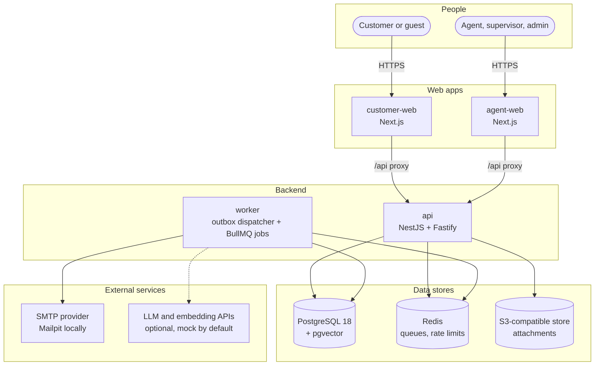
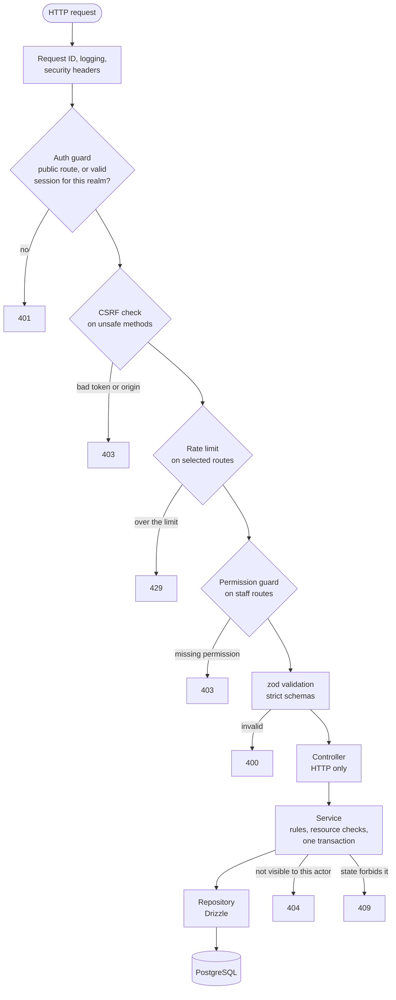
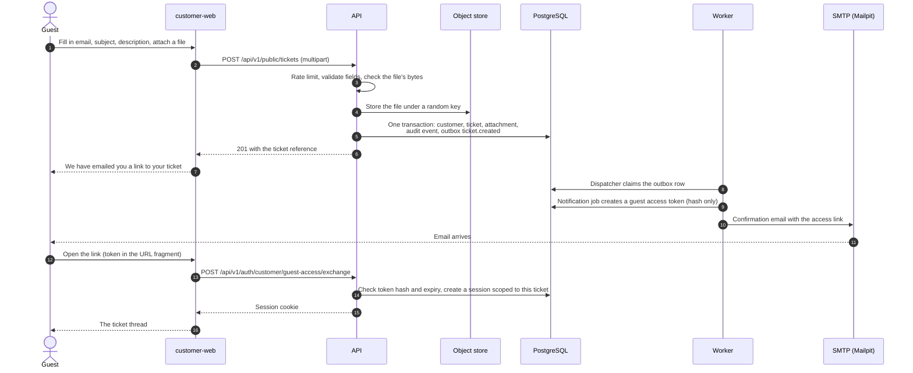
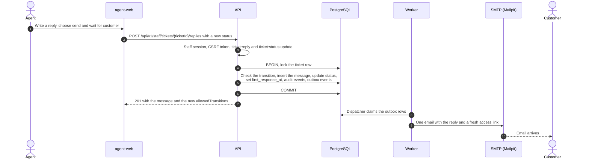
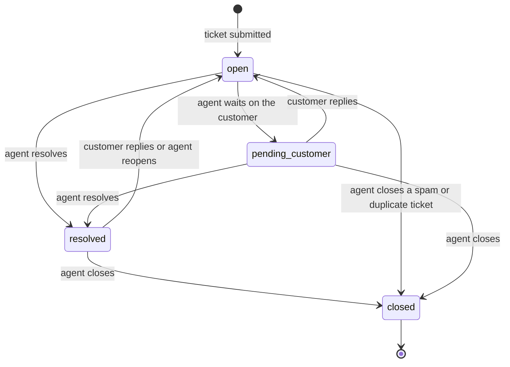
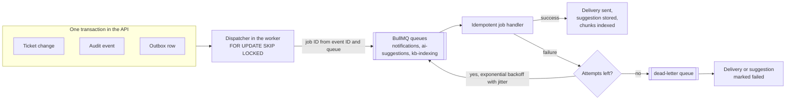
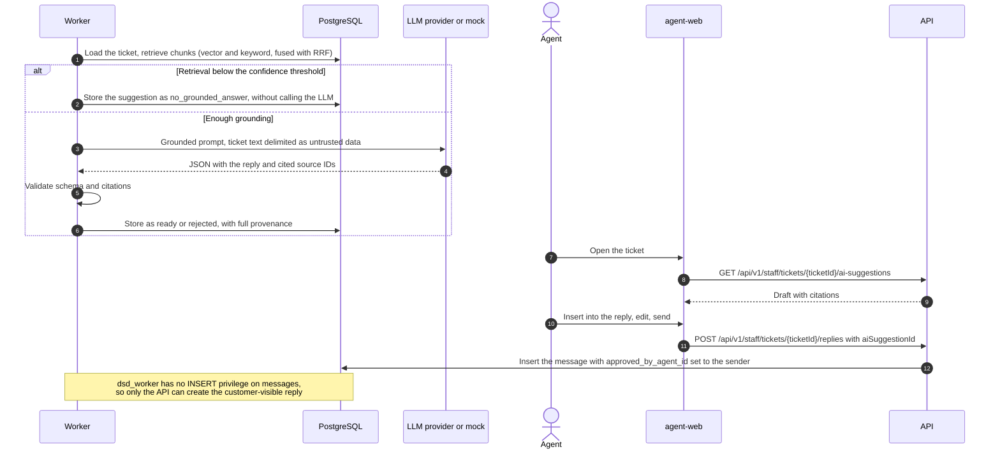
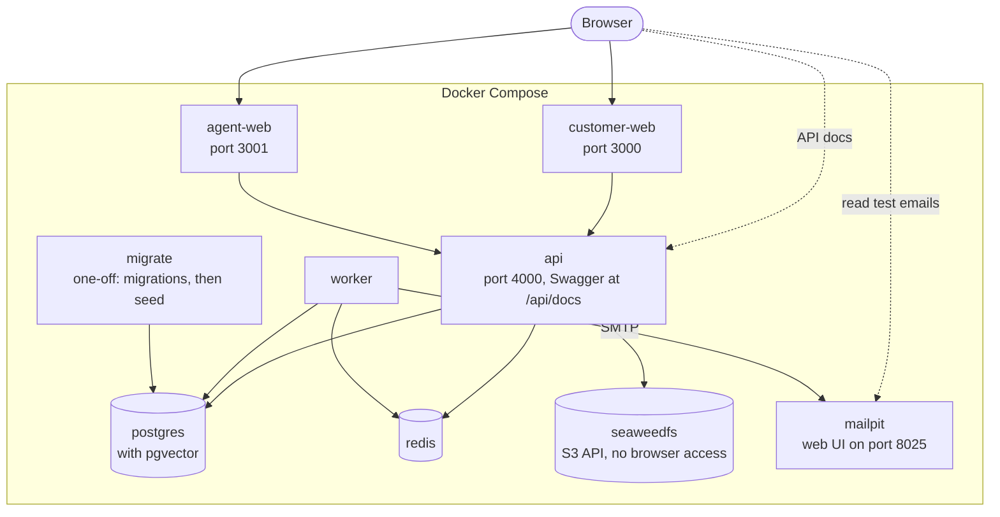

# Architecture

The DSD Unified Customer Support System is one backend with two front ends. Customers raise and follow support tickets through the customer app. Agents, supervisors and admins work those tickets through the agent app. Both apps are thin clients over a single versioned API, which owns the data, the business rules, authentication and notifications. A separate worker process does everything slow or unreliable: sending email, indexing the knowledge base and drafting AI reply suggestions.

This document shows how the pieces fit together and how requests and events move through them. The individual decisions, and the reasons for them, are in the [ADRs](adr/README.md). The tables are described in the [data model](DATA_MODEL.md).

The design is shaped by the properties reviewers check first:

- **The customer and staff boundary holds under deliberate attack.** Separate realms, server-side permissions and ownership enforced inside queries ([ADR-0003](adr/0003-authentication-and-sessions.md), [ADR-0004](adr/0004-authorization-rbac.md)).
- **AI text never reaches a customer without an agent sending it.** Enforced in code, database privileges and constraints ([ADR-0006](adr/0006-ai-suggestions-and-guardrail.md)).
- **Ticket history can't be rewritten.** Append-only tables guarded by triggers ([ADR-0008](adr/0008-data-integrity-and-db-roles.md)).
- **Any API instance can serve any request,** and a failing email or LLM provider never stops core support work ([ADR-0005](adr/0005-outbox-queues-notifications.md)).

## Components

Customers receive notifications by email, sent by the worker through the SMTP provider.

| Component      | Responsibility                                                                                                                                  | Talks to                               | Never talks to                                   |
| -------------- | ----------------------------------------------------------------------------------------------------------------------------------------------- | -------------------------------------- | ------------------------------------------------ |
| `customer-web` | Ticket submission, guest access, sign-up and sign-in, "My tickets", ticket thread, knowledge-base browsing and search                           | The API, through its own `/api` proxy  | The database, Redis, the object store            |
| `agent-web`    | Queue, ticket view, replies and notes, assignment, escalation, canned responses, AI suggestion panel, reporting, agent and knowledge-base admin | The API, through its own `/api` proxy  | The database, Redis, the object store            |
| `api`          | Every business rule, authentication and authorisation, validation, audit trail, outbox events, attachment upload and download                   | PostgreSQL, Redis, the object store    | SMTP, LLM providers (that is worker work)        |
| `worker`       | Outbox dispatch, notifications, knowledge-base chunking and embedding, AI suggestions, cleanup jobs                                             | PostgreSQL, Redis, SMTP, LLM providers | The API's code; the `messages` table for writing |

The front ends never talk to a data store. Everything they show comes from the documented API (FR-16), and they hold no business rules (NFR-12). Code layout and the rules that enforce these boundaries are in [ADR-0002](adr/0002-monorepo-layout.md).

## Inside the API

Requests pass through the same pipeline. Anything that fails a step stops there with a problem-details error.

- **Controllers** translate HTTP into service calls and back. They contain no rules.
- **Services** own the rules: the ticket state machine, ownership and brand checks, rank rules for agent management. Every mutation runs in one transaction that also writes its audit event and outbox rows.
- **Repositories** are the only code that talks to the database. Customer-realm repository methods take the session's customer (and guest ticket) as a parameter and filter on it in SQL, so they can't return another customer's rows.
- **Global pieces:**
  - an exception filter that turns every error into RFC 9457 problem details;
  - a request-ID hook;
  - pino logging with redaction;
  - helmet security headers;
  - a CORS allowlist;
  - Swagger UI.

## API conventions

- **Versioning.** Every route lives under `/api/v1` (API-2). `/health` and `/ready` sit outside it because infrastructure calls them.
- **Documentation.** The OpenAPI 3.1 document is generated from the same zod schemas that validate requests. It is served by Swagger UI at `/api/docs` and committed as `apps/api/openapi.json`. CI fails if the committed file is out of date (API-1).
- **Format.** JSON, with camelCase field names, UUID identifiers and ISO 8601 UTC timestamps. The ticket `reference` (`DSD-000123`) is for people. URLs use IDs.
- **Errors.** `application/problem+json` with `type`, `title`, `status`, `detail` and `instance`, plus `requestId`. Validation errors add `errors: [{ path, message }]`.

| Status | Meaning in this API                                                                                         |
| ------ | ----------------------------------------------------------------------------------------------------------- |
| 400    | The request doesn't match its schema, including unknown fields                                              |
| 401    | No valid session for this route's realm                                                                     |
| 403    | The resource is visible but the action is not permitted, or the CSRF check failed                           |
| 404    | The resource doesn't exist, or isn't visible to this actor                                                  |
| 409    | The current state forbids the action (invalid status transition, ticket already claimed, last active admin) |
| 413    | Upload too large                                                                                            |
| 415    | Upload type not allowed                                                                                     |
| 422    | Well-formed, but refers to something unusable (for example an AI suggestion from another ticket)            |
| 429    | Rate limit exceeded; `Retry-After` says when to try again                                                   |
| 503    | A dependency needed for this request is unavailable                                                         |

- **Pagination.** List endpoints take `limit` (default 25, maximum 100) and an opaque `cursor`, and return `{ items, nextCursor }`. Cursors encode the sort key and ID (keyset pagination), so pages stay stable while new tickets arrive and deep pages cost the same as the first.
- **Queue filters.** `status`, `priority`, `assignee` (`me`, `unassigned` or an agent ID), `escalated`, and `sort` (`priority`, `oldest`, `newest`).
- **Request IDs.** An incoming `X-Request-Id` is kept if it is a valid UUID, otherwise one is generated. It is returned on every response and appears in every log line and audit event.

### Route map

This is the shape of the API by realm. The ticket and attachment routes are built and documented in the OpenAPI document ([ADR-0011](adr/0011-ticket-api.md)); the rest are preliminary until their phase publishes them.

| Realm         | Routes                                                                                                                                                                                                                                                                                                                                                                                                                                                   |
| ------------- | -------------------------------------------------------------------------------------------------------------------------------------------------------------------------------------------------------------------------------------------------------------------------------------------------------------------------------------------------------------------------------------------------------------------------------------------------------- |
| Public        | `GET /api/v1/public/kb/articles` (search and browse), `GET /api/v1/public/kb/articles/{slug}`, `GET /api/v1/public/kb/categories`, `POST /api/v1/public/tickets` (guest submission)                                                                                                                                                                                                                                                                      |
| Customer auth | `POST /api/v1/auth/customer/login`, `POST .../logout`, `GET .../me`, `POST .../signup`, `POST .../signup/complete`, `POST .../guest-access/request`, `POST .../guest-access/exchange`                                                                                                                                                                                                                                                                    |
| Customer      | `GET` and `POST /api/v1/customer/tickets`, `GET /api/v1/customer/tickets/{ticketId}`, `POST .../{ticketId}/messages`, `GET .../{ticketId}/attachments/{attachmentId}`                                                                                                                                                                                                                                                                                    |
| Staff auth    | `POST /api/v1/auth/staff/login`, `POST .../logout`, `GET .../me`, `POST .../invite/complete`                                                                                                                                                                                                                                                                                                                                                             |
| Staff tickets | `GET /api/v1/staff/tickets` (queue), `GET .../{ticketId}`, `POST .../{ticketId}/replies`, `POST .../{ticketId}/notes`, `PATCH .../{ticketId}/status`, `PATCH .../{ticketId}/priority`, `POST .../{ticketId}/assignment`, `POST .../{ticketId}/escalate`, `GET .../{ticketId}/audit-events`, `GET .../{ticketId}/attachments/{attachmentId}`, `GET` and `POST .../{ticketId}/ai-suggestions`, `POST /api/v1/staff/ai-suggestions/{suggestionId}/feedback` |
| Staff other   | `GET /api/v1/staff/customers/{customerId}` (with their tickets); knowledge base under `/api/v1/staff/kb/articles` and `/api/v1/staff/kb/categories` (create, edit, publish, unpublish, archive); `/api/v1/staff/canned-responses` (list, create, edit, retire, render for a ticket); `/api/v1/staff/reports/volume`, `/response-times`, `/agents`; `/api/v1/staff/agents` (list, invite, change role, deactivate, reactivate)                            |
| Operations    | `GET /health`, `GET /ready`                                                                                                                                                                                                                                                                                                                                                                                                                              |

## Request flows

### A guest submits a ticket

Submitting doesn't sign the guest in. Only the owner of the inbox can open the thread, because they are the only one who receives the link ([ADR-0003](adr/0003-authentication-and-sessions.md)).

### An agent replies and the customer is notified

The request finishes as soon as the transaction commits. Email is sent afterwards, so a slow or failing SMTP server never delays or breaks the agent's reply.

### Ticket lifecycle

Invalid transitions return 409. Internal notes are allowed in every status. Public replies are refused once a ticket is closed. The full rules, including assignment and escalation, are in [ADR-0007](adr/0007-ticket-lifecycle.md).

## Events and background work

Every mutation writes its outbox rows in the same transaction as the change, and the worker turns them into jobs ([ADR-0005](adr/0005-outbox-queues-notifications.md)).

| Event                                                                  | Consumed by                                                                  |
| ---------------------------------------------------------------------- | ---------------------------------------------------------------------------- |
| `ticket.created`                                                       | `notifications`, `ai-suggestions`                                            |
| `message.created`                                                      | `notifications` (public agent replies), `ai-suggestions` (customer messages) |
| `ticket.status_changed`                                                | `notifications`                                                              |
| `ticket.priority_changed`, `ticket.assigned`, `ticket.escalated`       | No consumer yet; kept for future subscribers                                 |
| `kb.article_published`, `kb.article_unpublished`                       | `kb-indexing`                                                                |
| `ai.suggestion_requested`                                              | `ai-suggestions`                                                             |
| `customer.signup_requested`, `guest_access.requested`, `agent.invited` | `notifications`                                                              |

If Redis is down, the outbox rows simply wait in Postgres and are dispatched when it comes back.

## AI reply suggestions

The worker can only ever produce a draft. Sending is always an agent action through the reply endpoint, and the database enforces that too ([ADR-0006](adr/0006-ai-suggestions-and-guardrail.md), [ADR-0008](adr/0008-data-integrity-and-db-roles.md)).

## Security boundaries

- **Realms and permissions.**
  - Customer and staff sessions are separated by route prefix, cookie and session row.
  - Staff routes check permissions on every request.
  - Customer data is filtered by ownership inside the queries themselves.
  - See [ADR-0003](adr/0003-authentication-and-sessions.md) and [ADR-0004](adr/0004-authorization-rbac.md).
- **Internal notes (FR-10).**
  - Customer-realm queries always filter on `visibility = 'public'`.
  - Customer response schemas have no field that could carry a note.
  - Attachments inherit the visibility of their message.
  - Notification templates only ever include public messages.
- **AI guardrail.** Layered as described above and in [ADR-0006](adr/0006-ai-suggestions-and-guardrail.md).
- **Attachments.** Checked by content, stored privately and downloaded only through an access-checked endpoint ([ADR-0009](adr/0009-attachments.md)).
- **Input validation and output encoding (NFR-7).**
  - Every request is validated against a strict zod schema.
  - React escapes text by default, and the apps never use `dangerouslySetInnerHTML`.
  - Knowledge-base markdown is rendered through a sanitiser with an allowlist: no raw HTML, no scripts, safe link protocols only.
  - Search snippets use neutral markers that React turns into `<mark>` elements, instead of HTML from the database.
  - Email templates escape every value.
  - AI drafts are shown as plain text.
- **HTTP headers.**
  - helmet sets the API headers: `nosniff` and `frame-ancestors 'none'` everywhere, and HSTS in production.
  - Both web apps send a Content Security Policy.
  - The customer app's guest access page adds `Referrer-Policy: no-referrer`.
- **SQL.**
  - Drizzle parameterises every query.
  - Raw SQL is written only with the `sql` tagged template, which also parameterises values.
  - Nothing is ever concatenated into SQL.
- **Secrets and logs.**
  - Configuration comes from environment variables, validated at startup, and the apps refuse to start with bad config.
  - pino redacts cookies, authorization headers, passwords and tokens.
  - Message bodies are never logged.

## When a dependency fails

| Dependency down       | Customers can submit                       | Agents can reply          | What happens                                                                                                           |
| --------------------- | ------------------------------------------ | ------------------------- | ---------------------------------------------------------------------------------------------------------------------- |
| SMTP provider         | Yes                                        | Yes                       | Notification jobs retry with backoff, then go to the dead-letter queue. Delivery rows show `failed`.                   |
| LLM or embeddings API | Yes                                        | Yes                       | Suggestion jobs retry, then the suggestion is marked `failed` and the agent sees "suggestion unavailable".             |
| Redis                 | Yes (the submission rate limit fails open) | Yes, if already signed in | Logins return 503 (their rate limits fail closed). Outbox rows wait in Postgres and are dispatched when Redis returns. |
| Object store          | Yes, without attachments                   | Yes, without attachments  | Uploads and downloads return 503.                                                                                      |
| PostgreSQL            | No                                         | No                        | Postgres is the system of record, so the API reports itself unavailable.                                               |

**Health endpoints.**

- `/health` is liveness only: the process is running and can answer.
- `/ready` checks Postgres and Redis and reports each one:
  - Postgres unreachable: 503.
  - Only Redis unreachable: 200 with `"status": "degraded"`.

The degraded case is deliberate. Core support work keeps running without Redis. If every instance reported itself unready, the load balancer would take all of them out of service, turning a partial outage into a total one.

## Deployment

Locally, and for reviewers, the whole stack runs with Docker Compose. The service names and ports below are proposals, which Phase 1 finalises.

- The `migrate` service runs migrations as `dsd_migrator` and seeds demo data, then exits. The API and worker start after it succeeds and connect as `dsd_api` and `dsd_worker`.
- The object store and the databases are not needed from the browser. Their ports are published on the host's loopback interface only, so the tests and a host-run API can reach them, and the object store refuses any request without its access key.
- The web apps have fixed addresses on a fixed subnet, and the API believes `X-Forwarded-For` from those two addresses only. Each web app replaces the header with the browser's real address before Next.js sees the request ([ADR-0010](adr/0010-client-address-behind-the-web-proxy.md)).
- Nothing depends on a specific cloud provider (NFR-13). Postgres, Redis, any S3-compatible store and any SMTP server are enough to run it anywhere.

## Statelessness (NFR-2)

The API keeps nothing in process memory between requests:

- Sessions live in Postgres.
- Rate-limit counters and queues live in Redis.
- Files live in the object store.

Any instance can serve any request, so the API scales by adding instances behind a load balancer. An integration test proves it by signing in through one API instance and using the session on a second.

## Observability

- **Logs.** Structured JSON (pino) with the request ID on every line. Worker logs carry the outbox event ID and job ID, so one customer action can be followed from the HTTP request to the email.
- **Timing.** A `Server-Timing` header on the queue, ticket view and reply endpoints reports server-side processing time. Phase 10 uses it to measure NFR-1 on a database seeded with 5,000+ tickets.
- **Not in v1.** Metrics and distributed tracing, via OpenTelemetry, are part of the scaling plan.

## Scaling notes

v1 is sized for one team and one brand. The README's "At 100x scale" section, written in Phase 11, covers the plan in full. In short, the design already allows:

- **Database reads.**
  - Read replicas for the queue and reporting.
  - PgBouncer for connection pooling.
  - Partitioning `messages` and `audit_events` by month.
  - Rollup tables for reporting.
- **API.** A short-lived Redis cache in front of session lookups.
- **Background work.**
  - More worker replicas per queue.
  - Change data capture in place of outbox polling.
- **Files.** Short-lived presigned downloads behind a CDN.
- **Search.** A dedicated search or vector store if the knowledge base grows far beyond Postgres's comfortable range.
- **Brands.** Row-level security per brand once more than one brand is live.
