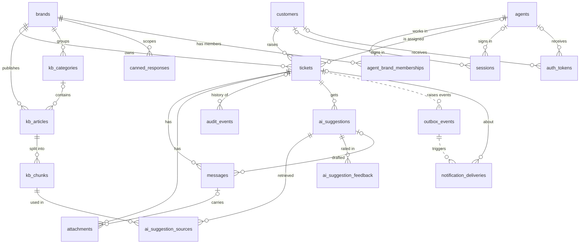
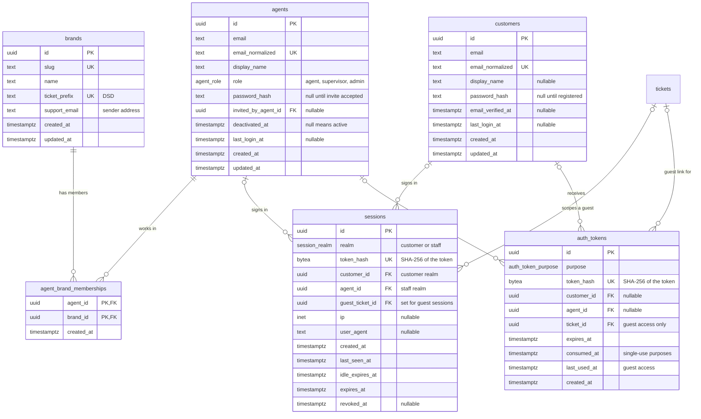
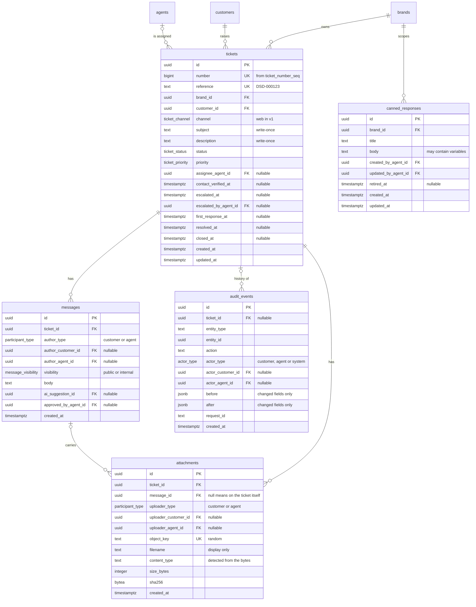
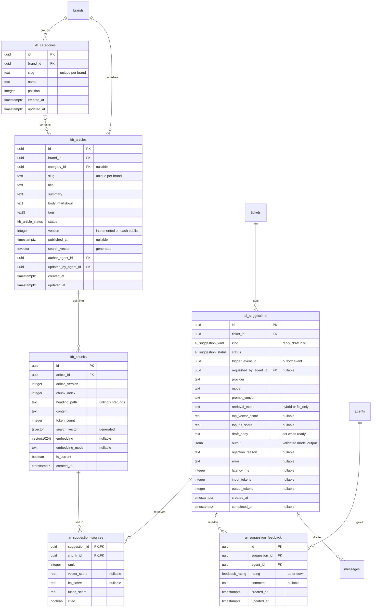
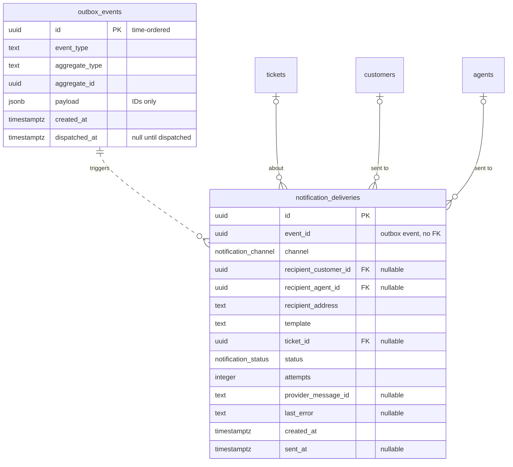

# Data model

This document describes the PostgreSQL schema for the DSD Unified Customer Support System: every table, how the tables relate, the constraints and triggers that protect the data, the indexes and the queries they serve, and which database role may touch what. It is the reference for the Drizzle schema and migrations in `packages/db`.

The reasoning behind the bigger choices lives in the ADRs, in particular [ADR-0003](adr/0003-authentication-and-sessions.md) (sessions and tokens), [ADR-0005](adr/0005-outbox-queues-notifications.md) (outbox), [ADR-0006](adr/0006-ai-suggestions-and-guardrail.md) (AI suggestions), [ADR-0007](adr/0007-ticket-lifecycle.md) (ticket lifecycle) and [ADR-0008](adr/0008-data-integrity-and-db-roles.md) (integrity and roles).

## Conventions

- **Primary keys** are UUIDs generated by PostgreSQL 18's `uuidv7()`. They are time-ordered, so new rows land at the end of B-tree indexes and IDs sort roughly by creation time.
- **Timestamps** are `timestamptz`, stored in UTC. Mutable tables have `created_at` and `updated_at`; append-only tables have only `created_at`.
- **Names** are snake_case. Tables are plural and foreign keys are named `<thing>_id`. Column names use American spelling, as code identifiers usually do.
- **Enums.** Small, closed sets that the state machine or the permission rules depend on are Postgres enums. Open-ended sets (audit actions, event types) are `text`, validated against the shared zod enums, so adding a value doesn't need an enum migration.
- **Deletion.** History is never deleted. People and content are deactivated, retired or archived instead. Foreign keys that point at history use `ON DELETE RESTRICT`.
- **Email addresses** are stored as entered, plus an `email_normalized` copy (trimmed and lowercased) that carries the unique index.
- **Brand and channel.** `brand_id` sits on every brand-owned row from the start, and `channel` is an attribute of the ticket (see [Multi-brand and multi-channel readiness](#multi-brand-and-multi-channel-readiness)).

## How the SRS entities map to tables

| SRS entity (§5)  | Table(s)                                                 | Notes                                                                                              |
| ---------------- | -------------------------------------------------------- | -------------------------------------------------------------------------------------------------- |
| User (customer)  | `customers`                                              | `password_hash` is empty for customers without an account, which gives the "optional credentials". |
| Agent            | `agents`                                                 | Holds agents, supervisors and admins; the role is a column.                                        |
| Role             | `agents.role` (`agent_role` enum) and the permission map | Roles map to permissions in code ([ADR-0004](adr/0004-authorization-rbac.md)).                     |
| Ticket           | `tickets`                                                |                                                                                                    |
| Message          | `messages`                                               | `visibility` separates customer-facing replies from internal notes.                                |
| Attachment       | `attachments`                                            | Belongs to a ticket, and optionally to a message.                                                  |
| KnowledgeArticle | `kb_articles`, `kb_categories`                           | Tags are a `text[]` column.                                                                        |
| AuditEvent       | `audit_events`                                           |                                                                                                    |
| Channel          | `tickets.channel` (`ticket_channel` enum)                | An attribute, not a table per channel.                                                             |

Tables beyond SRS §5:

| Concept                  | Table(s)                                                            |
| ------------------------ | ------------------------------------------------------------------- |
| Brand                    | `brands`, `agent_brand_memberships`                                 |
| Session                  | `sessions`, `auth_tokens`                                           |
| Outbox                   | `outbox_events`, `notification_deliveries`                          |
| AI suggestion            | `ai_suggestions`, `ai_suggestion_sources`, `ai_suggestion_feedback` |
| Canned response          | `canned_responses`                                                  |
| KB chunks and embeddings | `kb_chunks`                                                         |

## Overview

Relationships only. The four diagrams after this one show the columns. Dotted lines are logical links without a foreign key.

## Identity and access

- **`customers`** holds everyone who has raised a ticket or registered. Guest submission finds or creates a row by `email_normalized`. Registration sets `password_hash` and `email_verified_at` on the same row, which is why earlier guest tickets appear in the new account without any merging.
- **`agents`** holds all staff. `deactivated_at` is the single source of "is this agent active". An invited agent has no `password_hash` until they accept the invite.
- **`agent_brand_memberships`** scopes each agent to brands. v1 seeds one brand and gives every agent membership.
- **`sessions`** stores only the hash of each session token. A guest session is a customer-realm session with `guest_ticket_id` set, which limits it to that one ticket.
- **`auth_tokens`** holds one-off tokens for guest links, signup verification, agent invites and password resets. The worker creates a row when it sends the email that carries the token ([ADR-0003](adr/0003-authentication-and-sessions.md)).

## Ticketing

- **`tickets`**. `number` comes from the `ticket_number_seq` sequence. `reference` is built on insert by a trigger as the brand's prefix, a hyphen and the number zero-padded to at least six digits: `DSD-000123`. Larger numbers simply get longer (`DSD-1234567`) and are never truncated. The description is stored on the ticket and shown as the first entry of the thread. `messages` holds everything after it.
- **`messages`** is append-only. `visibility = 'internal'` marks an internal note. `ai_suggestion_id` and `approved_by_agent_id` record that an agent sent a reply built from an AI suggestion.
- **`attachments`** belong to a ticket and, when attached to a reply or note, to that message. They inherit its visibility.
- **`audit_events`** is append-only. `ticket_id` is set for ticket history and empty for events such as an agent's role changing.
- **`canned_responses`** are brand-scoped reply templates. Variables such as `{{customer.name}}`, `{{ticket.reference}}` and `{{agent.name}}` are filled in by the API, and the agent can edit the result before sending. Retiring a template hides it without deleting it.

## Knowledge base and AI

- **`kb_articles.search_vector`** is a stored generated column: the title weighted A, the summary weighted B and the body weighted C, using the `english` text search configuration. Tags are matched by filter (a GIN index on the array) rather than folded into the text search.
- **`kb_articles.version`** increases each time the article is published. Saving a published article publishes the saved text as the next version, so readers and the AI index always have the same text; drafts and archived articles are edited without a new version ([ADR-0012](adr/0012-knowledge-base-canned-responses-reports-and-agents.md)). `published_at` is the time of the latest publication.
- **`kb_chunks`** holds the retrieval units. A new version of an article gets new chunks, and the old ones stay with `is_current = false` so stored suggestions can still show the exact text they used. `embedding` is empty when no embedding provider is configured, and `embedding_model` records which model produced each vector.
- **`ai_suggestions`** is one row per suggestion attempt, with its full provenance ([ADR-0006](adr/0006-ai-suggestions-and-guardrail.md)). `kind` leaves room for triage and sentiment later (FR-23).
- **`ai_suggestion_sources`** lists every chunk retrieved for a suggestion with its rank and scores, and flags the ones the draft cited.
- **`ai_suggestion_feedback`** holds one rating per agent per suggestion.

## Events and notifications

- **`outbox_events`** is written in the same transaction as the change it describes, and moved onto BullMQ by the worker's dispatcher ([ADR-0005](adr/0005-outbox-queues-notifications.md)). Payloads carry IDs, never message bodies or email addresses.
- **`notification_deliveries`** records each notification per channel and recipient. Its unique key makes the notification handler idempotent. `event_id` has no foreign key because dispatched outbox rows are deleted after seven days.

## Enums

| Enum                   | Values                                                                     | Notes                                                     |
| ---------------------- | -------------------------------------------------------------------------- | --------------------------------------------------------- |
| `ticket_status`        | `open`, `pending_customer`, `resolved`, `closed`                           | Transitions in [ADR-0007](adr/0007-ticket-lifecycle.md)   |
| `ticket_priority`      | `low`, `normal`, `high`, `urgent`                                          | Declared in this order, so it sorts by urgency            |
| `ticket_channel`       | `web`, `email`, `chat`, `whatsapp`                                         | Only `web` is used in v1                                  |
| `agent_role`           | `agent`, `supervisor`, `admin`                                             | Permissions in [ADR-0004](adr/0004-authorization-rbac.md) |
| `session_realm`        | `customer`, `staff`                                                        |                                                           |
| `auth_token_purpose`   | `guest_ticket_access`, `customer_signup`, `agent_invite`, `password_reset` |                                                           |
| `participant_type`     | `customer`, `agent`                                                        | Authors of messages and uploaders of attachments          |
| `actor_type`           | `customer`, `agent`, `system`                                              | Actors in audit events                                    |
| `message_visibility`   | `public`, `internal`                                                       | `internal` marks an internal note                         |
| `kb_article_status`    | `draft`, `published`, `archived`                                           |                                                           |
| `ai_suggestion_kind`   | `reply_draft`                                                              | `triage` and `sentiment` are expected later (FR-23)       |
| `ai_suggestion_status` | `pending`, `ready`, `no_grounded_answer`, `rejected`, `failed`             |                                                           |
| `feedback_rating`      | `up`, `down`                                                               |                                                           |
| `notification_channel` | `email`                                                                    | `sms` and `whatsapp` are added with their adapters        |
| `notification_status`  | `pending`, `sent`, `failed`                                                |                                                           |

## Constraints

### CHECK constraints

| Table            | Constraint                             | Expression                                                                                                                                                                                                                                                                                                                                       |
| ---------------- | -------------------------------------- | ------------------------------------------------------------------------------------------------------------------------------------------------------------------------------------------------------------------------------------------------------------------------------------------------------------------------------------------------ |
| `brands`         | `brands_ticket_prefix_ck`              | `ticket_prefix ~ '^[A-Z]{2,8}$'`                                                                                                                                                                                                                                                                                                                 |
| `customers`      | `customers_password_needs_verified_ck` | `password_hash IS NULL OR email_verified_at IS NOT NULL`                                                                                                                                                                                                                                                                                         |
| `sessions`       | `sessions_realm_ck`                    | `(realm = 'customer' AND customer_id IS NOT NULL AND agent_id IS NULL) OR (realm = 'staff' AND agent_id IS NOT NULL AND customer_id IS NULL AND guest_ticket_id IS NULL)`                                                                                                                                                                        |
| `sessions`       | `sessions_expiry_ck`                   | `expires_at > created_at`                                                                                                                                                                                                                                                                                                                        |
| `auth_tokens`    | `auth_tokens_subject_ck`               | `(purpose = 'guest_ticket_access' AND ticket_id IS NOT NULL AND customer_id IS NOT NULL AND agent_id IS NULL) OR (purpose IN ('customer_signup', 'password_reset') AND customer_id IS NOT NULL AND agent_id IS NULL AND ticket_id IS NULL) OR (purpose = 'agent_invite' AND agent_id IS NOT NULL AND customer_id IS NULL AND ticket_id IS NULL)` |
| `tickets`        | `tickets_subject_length_ck`            | `char_length(subject) BETWEEN 1 AND 200`                                                                                                                                                                                                                                                                                                         |
| `tickets`        | `tickets_description_length_ck`        | `char_length(description) BETWEEN 1 AND 20000`                                                                                                                                                                                                                                                                                                   |
| `tickets`        | `tickets_resolved_at_ck`               | `resolved_at IS NULL OR status IN ('resolved', 'closed')`                                                                                                                                                                                                                                                                                        |
| `tickets`        | `tickets_closed_at_ck`                 | `(status = 'closed') = (closed_at IS NOT NULL)`                                                                                                                                                                                                                                                                                                  |
| `tickets`        | `tickets_first_response_ck`            | `first_response_at IS NULL OR first_response_at >= created_at`                                                                                                                                                                                                                                                                                   |
| `tickets`        | `tickets_escalation_ck`                | `(escalated_at IS NULL) = (escalated_by_agent_id IS NULL)`                                                                                                                                                                                                                                                                                       |
| `messages`       | `messages_author_ck`                   | `(author_type = 'customer' AND author_customer_id IS NOT NULL AND author_agent_id IS NULL) OR (author_type = 'agent' AND author_agent_id IS NOT NULL AND author_customer_id IS NULL)`                                                                                                                                                            |
| `messages`       | `messages_customer_public_ck`          | `author_type <> 'customer' OR visibility = 'public'`                                                                                                                                                                                                                                                                                             |
| `messages`       | `messages_ai_approval_ck`              | `ai_suggestion_id IS NULL OR approved_by_agent_id IS NOT NULL`                                                                                                                                                                                                                                                                                   |
| `messages`       | `messages_approver_is_author_ck`       | `approved_by_agent_id IS NULL OR approved_by_agent_id = author_agent_id`                                                                                                                                                                                                                                                                         |
| `messages`       | `messages_body_length_ck`              | `char_length(body) BETWEEN 1 AND 20000`                                                                                                                                                                                                                                                                                                          |
| `attachments`    | `attachments_uploader_ck`              | `(uploader_type = 'customer' AND uploader_customer_id IS NOT NULL AND uploader_agent_id IS NULL) OR (uploader_type = 'agent' AND uploader_agent_id IS NOT NULL AND uploader_customer_id IS NULL)`                                                                                                                                                |
| `attachments`    | `attachments_size_ck`                  | `size_bytes BETWEEN 1 AND 10485760`                                                                                                                                                                                                                                                                                                              |
| `audit_events`   | `audit_events_actor_ck`                | `(actor_type = 'system' AND actor_customer_id IS NULL AND actor_agent_id IS NULL) OR (actor_type = 'customer' AND actor_customer_id IS NOT NULL AND actor_agent_id IS NULL) OR (actor_type = 'agent' AND actor_agent_id IS NOT NULL AND actor_customer_id IS NULL)`                                                                              |
| `kb_articles`    | `kb_articles_published_ck`             | `status <> 'published' OR published_at IS NOT NULL`                                                                                                                                                                                                                                                                                              |
| `ai_suggestions` | `ai_suggestions_ready_ck`              | `status <> 'ready' OR draft_body IS NOT NULL`                                                                                                                                                                                                                                                                                                    |

### Unique constraints and composite keys

| Table                     | Columns                                      | Why                                                             |
| ------------------------- | -------------------------------------------- | --------------------------------------------------------------- |
| `customers`, `agents`     | `email_normalized`                           | One identity per email in each realm                            |
| `brands`                  | `slug`; `ticket_prefix`                      |                                                                 |
| `tickets`                 | `number`; `reference`                        |                                                                 |
| `kb_categories`           | `(brand_id, slug)`                           |                                                                 |
| `kb_articles`             | `(brand_id, slug)`                           | Stable public URLs per brand                                    |
| `kb_chunks`               | `(article_id, article_version, chunk_index)` | Re-indexing an article version replaces its chunks              |
| `canned_responses`        | `(brand_id, title) WHERE retired_at IS NULL` | No two active templates with the same name                      |
| `ai_suggestions`          | `(id, ticket_id)`                            | Target of the composite foreign key from `messages`             |
| `ai_suggestions`          | `(ticket_id, trigger_event_id)`              | One suggestion per triggering event, so retries don't duplicate |
| `ai_suggestion_feedback`  | `(suggestion_id, agent_id)`                  | One rating per agent                                            |
| `notification_deliveries` | `(event_id, channel, recipient_address)`     | Makes the notification handler idempotent                       |
| `sessions`, `auth_tokens` | `token_hash`                                 | Direct lookup by token hash                                     |
| `attachments`             | `object_key`                                 |                                                                 |

The composite foreign key `messages (ai_suggestion_id, ticket_id) REFERENCES ai_suggestions (id, ticket_id)` guarantees that a reply can only use a suggestion generated for its own ticket.

### Triggers

| Trigger                                                | Table          | Effect                                                                                                                    |
| ------------------------------------------------------ | -------------- | ------------------------------------------------------------------------------------------------------------------------- |
| `messages_append_only`, `messages_no_truncate`         | `messages`     | Rejects UPDATE, DELETE and TRUNCATE for every role                                                                        |
| `audit_events_append_only`, `audit_events_no_truncate` | `audit_events` | Rejects UPDATE, DELETE and TRUNCATE for every role                                                                        |
| `tickets_write_once`                                   | `tickets`      | Rejects changes to `reference`, `number`, `brand_id`, `customer_id`, `channel`, `subject`, `description` and `created_at` |
| `tickets_set_reference`                                | `tickets`      | Builds `reference` from the brand prefix and `number` on insert                                                           |

## Indexes

Each index exists for a specific query. Plans are checked with `EXPLAIN` on seeded data in Phase 2 and again with 5,000+ tickets in Phase 10.

| Table                     | Index                                                                           | Serves                                                                                 |
| ------------------------- | ------------------------------------------------------------------------------- | -------------------------------------------------------------------------------------- |
| `tickets`                 | `(brand_id, status, priority DESC, created_at)`                                 | The queue filtered by status (and priority), sorted by priority then age (FR-7)        |
| `tickets`                 | `(brand_id, created_at)`                                                        | The queue sorted by age across statuses; ticket volume reporting (FR-13)               |
| `tickets`                 | `(assignee_agent_id, status) WHERE assignee_agent_id IS NOT NULL`               | "My tickets"; tickets per agent                                                        |
| `tickets`                 | `(customer_id, created_at DESC)`                                                | A customer's own tickets (FR-3); the customer's other tickets in the agent view (FR-8) |
| `tickets`                 | `(brand_id, escalated_at) WHERE escalated_at IS NOT NULL`                       | The escalated-tickets filter                                                           |
| `tickets`                 | `(brand_id, resolved_at) WHERE resolved_at IS NOT NULL`                         | Time-to-resolution reporting by resolution date                                        |
| `messages`                | `(ticket_id, created_at, id)`                                                   | Loading a thread in order                                                              |
| `attachments`             | `(ticket_id)`; `(message_id)`                                                   | Listing a ticket's or a message's attachments                                          |
| `audit_events`            | `(ticket_id, created_at)`                                                       | A ticket's history and the customer's status timeline                                  |
| `audit_events`            | `(entity_type, entity_id, created_at)`                                          | History of non-ticket entities, such as an agent's role changes                        |
| `sessions`                | `(expires_at)`                                                                  | Cleanup of expired sessions                                                            |
| `sessions`                | `(agent_id) WHERE revoked_at IS NULL`; `(customer_id) WHERE revoked_at IS NULL` | Revoking all of one identity's sessions                                                |
| `auth_tokens`             | `(expires_at)`                                                                  | Cleanup of expired tokens                                                              |
| `outbox_events`           | `(id) WHERE dispatched_at IS NULL`                                              | The dispatcher's next batch                                                            |
| `outbox_events`           | `(dispatched_at) WHERE dispatched_at IS NOT NULL`                               | Cleanup of dispatched rows                                                             |
| `notification_deliveries` | `(status, created_at)`                                                          | Finding failed deliveries                                                              |
| `kb_articles`             | GIN `(search_vector)`                                                           | Knowledge-base keyword search (FR-4)                                                   |
| `kb_articles`             | `(brand_id, status, published_at DESC)`                                         | Browsing published articles                                                            |
| `kb_articles`             | GIN `(tags)`                                                                    | Filtering by tag                                                                       |
| `kb_chunks`               | HNSW `(embedding vector_cosine_ops)`                                            | Vector retrieval for AI suggestions                                                    |
| `kb_chunks`               | GIN `(search_vector)`                                                           | Keyword retrieval for AI suggestions                                                   |
| `kb_chunks`               | `(article_id, is_current)`                                                      | Retiring an article's chunks                                                           |
| `ai_suggestions`          | `(ticket_id, created_at DESC)`                                                  | The latest suggestion for a ticket                                                     |

Queue pagination is keyset-based (a cursor of the sort key plus `id`), so later pages cost the same as the first.

## Views

| View                       | Rows and columns                                                                                                                   | `dsd_api` | `dsd_worker` |
| -------------------------- | ---------------------------------------------------------------------------------------------------------------------------------- | --------- | ------------ |
| `public_reply_bodies`      | `id`, `ticket_id`, `body`, `created_at` and `author_agent_id` of messages with `visibility = 'public'` and `author_type = 'agent'` | none      | S            |
| `public_customer_messages` | `id`, `ticket_id`, `body` and `created_at` of messages with `visibility = 'public'` and `author_type = 'customer'`                 | none      | S            |

- **`public_reply_bodies`**: notification emails quote an agent's public reply and name its author.
- **`public_customer_messages`**: the AI pipeline drafts a reply from what the customer wrote (migration 0006).
- These two views are the only message text the worker can read. Both are owned by `dsd_migrator` and aren't `security_invoker`, so they read `messages` with their owner's rights while the worker has no privilege on `messages` at all. Internal notes can't reach the worker, an email or a prompt by any query ([ADR-0006](adr/0006-ai-suggestions-and-guardrail.md), [ADR-0008](adr/0008-data-integrity-and-db-roles.md), amended).

## Database roles and privileges

S = SELECT, I = INSERT, U = UPDATE, D = DELETE. Anything not listed is not granted. Reasoning in [ADR-0008](adr/0008-data-integrity-and-db-roles.md).

| Table                     | `dsd_api` | `dsd_worker`                           |
| ------------------------- | --------- | -------------------------------------- |
| `brands`                  | S         | S                                      |
| `customers`               | S I U     | S                                      |
| `agents`                  | S I U     | S                                      |
| `agent_brand_memberships` | S I D     | S                                      |
| `sessions`                | S I U D   | D, plus S on the expiry columns only   |
| `auth_tokens`             | S I U D   | I D, plus S on the expiry columns only |
| `tickets`                 | S I U     | S                                      |
| `messages`                | S I       | none                                   |
| `attachments`             | S I       | S                                      |
| `audit_events`            | S I       | none                                   |
| `outbox_events`           | I         | S U D                                  |
| `notification_deliveries` | S         | S I U                                  |
| `kb_categories`           | S I U D   | S                                      |
| `kb_articles`             | S I U     | S                                      |
| `kb_chunks`               | S         | S I U                                  |
| `canned_responses`        | S I U     | none                                   |
| `ai_suggestions`          | S         | S I U                                  |
| `ai_suggestion_sources`   | S         | S I                                    |
| `ai_suggestion_feedback`  | S I U     | none                                   |

`dsd_api` also gets USAGE on `ticket_number_seq`. It reads `ai_suggestions` and never writes one: suggestions are the worker's output, and a reply records the one it used on the message (migration 0007 took away an INSERT grant nothing used). The worker reads message text only through the `public_reply_bodies` and `public_customer_messages` views (see [Views](#views)), never from `messages` itself. The worker's expiry columns are `expires_at` and `idle_expires_at` on `sessions`, and `expires_at` on `auth_tokens`: enough to find and delete expired rows, and nothing that identifies a session or its owner. `dsd_migrator` owns every object and is used only by migrations, the demo seed and, on a real deployment, the first-run bootstrap ([ADR-0008](adr/0008-data-integrity-and-db-roles.md), amended).

## Data lifecycle

| Data                                   | Kept for                 | Removed by                                                 |
| -------------------------------------- | ------------------------ | ---------------------------------------------------------- |
| `messages`, `audit_events`             | Forever (append-only)    | Nothing. A future redaction path is described in ADR-0008. |
| `tickets`, `attachments`               | Forever                  | Nothing in v1                                              |
| `sessions`                             | Until expiry             | A daily worker job deletes expired rows                    |
| `auth_tokens`                          | Until expiry plus 7 days | A daily worker job                                         |
| `outbox_events`                        | 7 days after dispatch    | A daily worker job                                         |
| `kb_chunks` that are no longer current | Kept for provenance      | Pruning is a scaling item                                  |
| `notification_deliveries`              | Kept                     | Pruning is a scaling item                                  |
| Objects with no `attachments` row      | 1 day                    | The orphan sweep ([ADR-0009](adr/0009-attachments.md))     |

## Multi-brand and multi-channel readiness

The SRS asks that v1 doesn't make multi-brand support (§11.1) or new intake channels (FR-6, §11.2) into a rewrite later. The schema covers both now, without building either:

- **Brands.** `brand_id` is on tickets, knowledge-base categories and articles, and canned responses. Agents are scoped through `agent_brand_memberships`, and every staff query filters by the agent's brands. The ticket reference prefix comes from the brand. v1 seeds one brand. A second brand means new rows and memberships, not new tables.
- **Channels.** `tickets.channel` records how a ticket arrived. Email-to-ticket or chat intake would create tickets through the same service with a different channel value, and everything downstream (queue, messages, audit, notifications) stays the same.
- **Notification channels.** `notification_deliveries.channel` and the `notification_channel` enum grow when SMS or WhatsApp adapters are added ([ADR-0005](adr/0005-outbox-queues-notifications.md)).

## Seed data

The seed is deterministic (a fixed faker seed) and clearly synthetic: no real people or companies. It includes one brand (`DSD`); demo accounts for a customer, an agent, a supervisor and an admin, with credentials listed in the README; customers with tickets in every status and priority; public replies and internal notes; canned responses; and a knowledge base for a fictional DSD product line: four categories and 35 articles, 33 of them published, for the AI suggestions to ground replies in (FR-24). Four scenarios carry a customer's file (a payment screenshot, a returns receipt, a parcel-label photo and a device log), built in code as real PNG, PDF and text files so they pass the same content check an upload gets. With an object store configured, as in Compose, the seed makes sure the bucket exists, stores each file under a random key, and writes its row and its `attachment.created` audit event with the rest of the data; without one (the test harness) it writes no files. A separate generator, `seed-bulk`, adds thousands of tickets with their customers, threads and history for performance runs ([PERFORMANCE.md](PERFORMANCE.md)).
